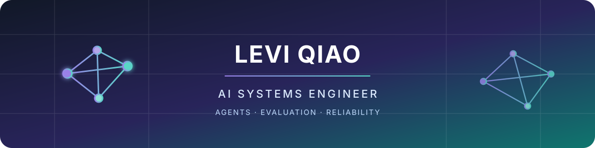

  

  

    <strong>AI engineer building reliable agent systems and production-grade developer tools.</strong> 
    10 years in software engineering · Architecture · Evaluation · Reliability
  

  

    
    
    
    
  

## What I build

I work where AI prototypes become dependable systems: agent architecture,
evaluation, orchestration, and the controls that make long-running autonomous
work inspectable and verifiable.

我做可评估、可追踪、可交付的智能体工程，重点是长任务里的 context death 和验收收敛。

## Featured

[**longgraph-skill**](https://github.com/levi-qiao/longgraph-skill) — long-horizon agent skill for Claude Code, Cursor, Codex, and Grok Build. Clean-context supervisor, multi-task ledger loop, verified gates. A markdown library (loop-graph), not a framework.

[**herdr-agent-quota**](https://github.com/levi-qiao/herdr-agent-quota) — live Claude, Codex, Grok, and Agy quota in the Herdr sidebar: 5h + weekly % remaining, reset ETAs, and time-aware quota health. Local-only; never hit a limit mid-task.

## Selected work

<!-- REPOS_START -->
| Project | Description | Stars |
| :--- | :--- | :---: |
| [**longgraph-skill**](https://github.com/levi-qiao/longgraph-skill) 🐙 | Long-horizon agent skill for Claude Code / Cursor / Codex / Grok Build — multi-task ledger loop, host-portable, clean-context supervisor, verified gates. Markdown library (loop-graph), not a framework. | ⭐ 67 |
| [**herdr-agent-quota**](https://github.com/levi-qiao/herdr-agent-quota) ⚡ | Credential-scoped AI quota, context, and cache in Herdr for Claude, Codex, Grok, Agy, OpenCode, Pi, and OMP. | ⭐ 45 |
| [**obsidian-llm-wiki**](https://github.com/levi-qiao/obsidian-llm-wiki) 🧠 | Compile notes into a linked Obsidian wiki at ingest time with Claude Code, following Karpathy's LLM Wiki idea instead of RAG-at-query. | ⭐ 10 |
| [**sherlock-claude**](https://github.com/levi-qiao/sherlock-claude) 🔍 | An AI-powered code analysis platform built on [Claude Agent SDK](https://github.com/anthropics/claude-code). It automatically analyzes codebases, diagnoses errors from logs, and generates targeted fix recommendations — all driven by YAML-configured agents and a reusable plugin skill system. | ⭐ 6 |
| [**dsh-plugin-longgraph**](https://github.com/levi-qiao/dsh-plugin-longgraph) 🧩 | DeepSeek Harness community plugin: longgraph / loop-graph / loop-converge authoring skills on ctx.skills | ⭐ 5 |
| [**agent-ding**](https://github.com/levi-qiao/agent-ding) 🔔 | Ding when your coding agent finishes — modular notifications, Zellij layouts, shell helpers | ⭐ 3 |
| [**sherlock-openai**](https://github.com/levi-qiao/sherlock-openai) | A lightweight platform for building and testing OpenAI Agents workflows with FastAPI backend, LiteLLM model routing, and React frontend | - |
<!-- REPOS_END -->

## Current focus

- **Long-horizon agents** — survive context death, keep state durable, make “done” checkable
- **Loop converge** — bind each loop to a real acceptance gate, not empty code churn
- **Quota-aware workspaces** — live 5h + weekly remaining in the Herdr sidebar so long tasks don’t die mid-run
- **Skill tooling** — turn docs and good sessions into installable skills
- **Evaluation & reliability** — evidence-based acceptance and failure analysis

## Engineering principles

> Make the state inspectable. Make “done” verifiable. Keep the system smaller
> than the problem it solves.

  Python · Rust · FastAPI · LLM agents · Evaluation · Automation · Developer tooling

